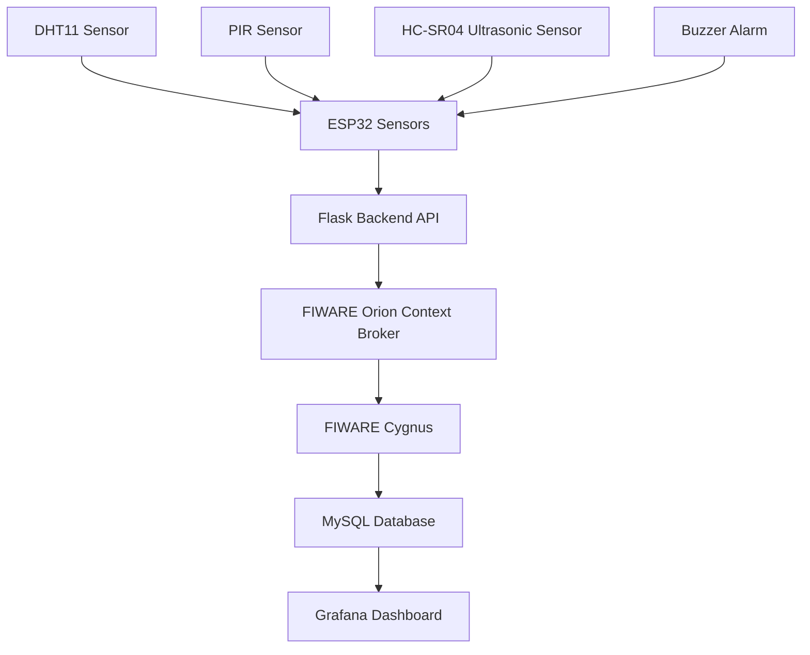

PROJECT OVERVIEW\
The Smart Security System is an IoT-based security monitoring solution developed using ESP32, FIWARE, Flask, MySQL, and Grafana. The system continuously monitors environmental and security-related parameters such as temperature, humidity, motion detection, and distance measurements. Data collected from sensors is transmitted to the FIWARE ecosystem, stored in a database, and visualized through an interactive Grafana dashboard.

The system now supports:
- Real-time sensor monitoring
- Data persistence using MySQL
- Historical data analysis
- Security event logging
- Interactive dashboard visualization

## System Architecture

HARDWARE COMPONENTS:

| Component                 | Purpose                           |
| ------------------------- | --------------------------------- |
| ESP32                     | Main Microcontroller              |
| PIR Sensor                | Motion Detection                  |
| HC-SR04 Ultrasonic Sensor | Distance Measurement              |
| DHT11 Sensor              | Temperature & Humidity Monitoring |
| Buzzer                    | Alarm Notification                |

SOFTWARE COMPONENTS:
- Python Flask
- FIWARE Orion Context Broker
- FIWARE Cygnus
- Postman 
- MySQL Database
- Grafana

IMPLEMENTED FEATURES

1. Real-Time Sensor Monitoring\
The ESP32 continuously reads data from:

DHT11 Sensor
- Temperature (°C)
- Humidity (%)
  
PIR Sensor
- Motion Detection
- Intrusion Monitoring
  
Ultrasonic Sensor
- Distance Measurement (cm)
  
Buzzer
- Activated when motion is detected

2. Data Transmission\
Sensor readings are sent from ESP32 to the Flask backend through HTTP requests.

Example reading:

Temp: 22.8°C\
Humidity: 51%\
Distance: 43.93 cm\
Motion: 0

Backend response:

{
  "message": "Security Data Sent Successfully",
  "orion_status": 204
}

The 204 response confirms successful updates to Orion Context Broker.

3. FIWARE Integration\
Orion Context Broker\
The Flask backend updates a Smart Security entity inside Orion.

Entity Attributes:

{\
  "temperature": 22.8,\
  "humidity": 51,\
  "distance": 43.93,\
  "motion": 0,\
  "armed": true\
}

Cygnus Subscription

Cygnus subscribes to entity updates and stores historical data in MySQL.

Subscription Status:

{
  "status": "active",
  "description": "Notify Cygnus"
}

4. Data Persistence
Sensor readings are automatically stored in MySQL using Cygnus.

Stored Information:
- Timestamp
- Temperature
- Humidity
- Distance
- Motion Status
- Armed Status

This enables historical analysis and long-term monitoring.

GRAFANA DASHBOARD\
An interactive dashboard was created to visualize security and environmental data.

Dashboard Panels

- System Status
Displays: SYSTEM ARMED
Indicates whether the security system is active.

- Intrusion Detection
Shows the latest motion detection status.

Values:
SAFE or INTRUSION DETECTED

- Total Intrusion Count\
Displays the total number of times motion was detected.

Purpose:\
-> Security analytics\
-> Event frequency monitoring

- Temperature Monitoring\
Visualization Type: Time Series Graph\
Displays temperature trends over time.

- Humidity Monitoring\
Visualization Type: Gauge

Thresholds:
| Range    | Status |
| -------- | ------ |
| 0 – 30   | Dry    |
| 30 – 60  | Normal |
| 60 – 100 | Humid  |

- Distance Monitoring\
Visualization Type: Time Series Graph\
Displays object proximity measurements from the ultrasonic sensor.

- Security Event Log\
Contains:\
-> Timestamp\
-> Sensor Attribute\
-> Sensor Value\

Provides historical records of all security events.

RESULTS\
The completed system provides a scalable and modular smart security platform capable of monitoring environmental conditions and intrusion events while maintaining historical records for future analysis.
